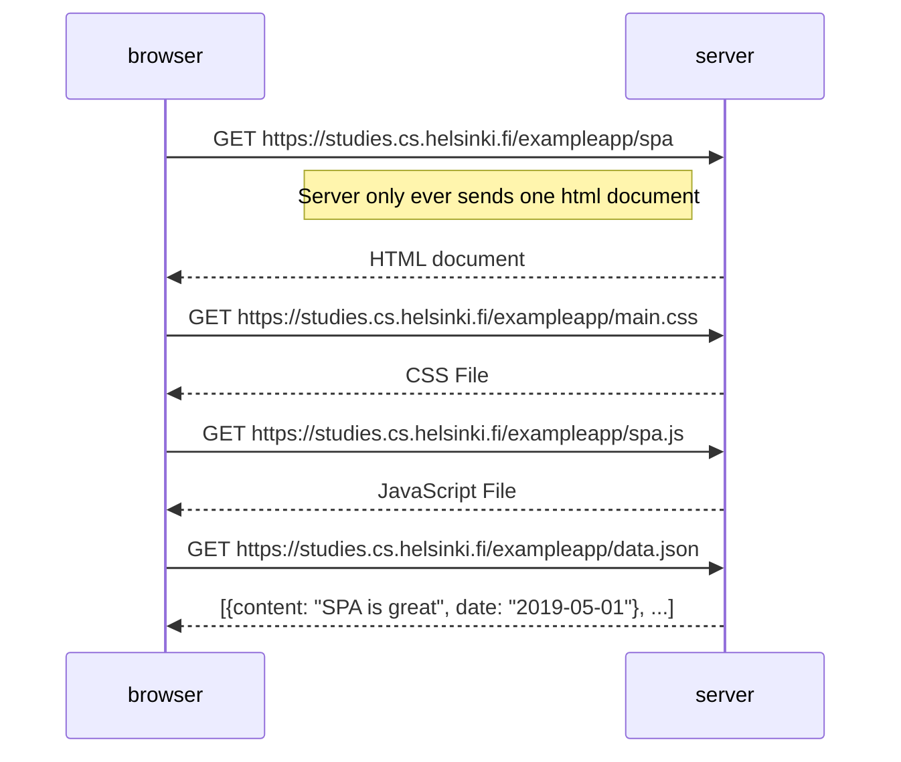

```mermaid
sequenceDiagram
    participant browser
    participant server


    browser->>server: GET https://studies.cs.helsinki.fi/exampleapp/spa
    Note left of server: Server only ever sends one html document
    server-->>browser: HTML document

    browser->>server: GET https://studies.cs.helsinki.fi/exampleapp/main.css
    server-->>browser: CSS File

    browser->>server: GET https://studies.cs.helsinki.fi/exampleapp/spa.js
    server-->>browser: JavaScript File

    browser->>server: GET https://studies.cs.helsinki.fi/exampleapp/data.json
    server-->>browser: [{content: "SPA is great", date: "2019-05-01"}, ...]

```
