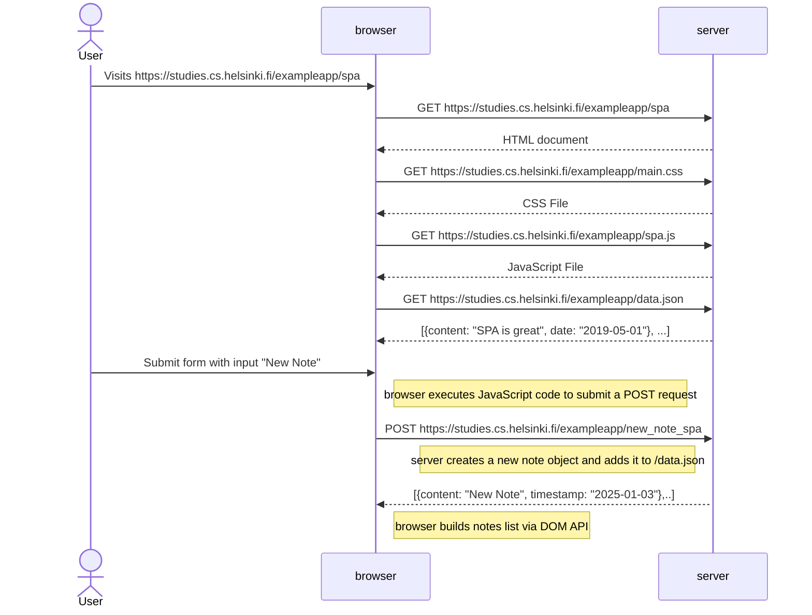

```mermaid
sequenceDiagram
    actor user as User
    participant browser
    participant server

    user->>browser: Visits https://studies.cs.helsinki.fi/exampleapp/spa
    browser->>server: GET https://studies.cs.helsinki.fi/exampleapp/spa
    server-->>browser: HTML document

    browser->>server: GET https://studies.cs.helsinki.fi/exampleapp/main.css
    server-->>browser: CSS File

    browser->>server: GET https://studies.cs.helsinki.fi/exampleapp/spa.js
    server-->>browser: JavaScript File

    browser->>server: GET https://studies.cs.helsinki.fi/exampleapp/data.json
    server-->>browser: [{content: "SPA is great", date: "2019-05-01"}, ...]

    user->>browser: Submit form with input "New Note"
    Note right of browser: browser executes JavaScript code to submit a POST request
    browser->>server: POST https://studies.cs.helsinki.fi/exampleapp/new_note_spa
    activate server
    Note left of server: server creates a new note object and adds it to /data.json
    server-->>browser: [{content: "New Note", timestamp: "2025-01-03"},..]
    
    Note right of browser: browser builds notes list via DOM API
   
```